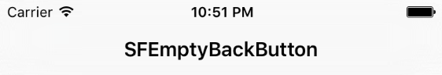
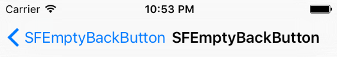
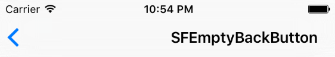
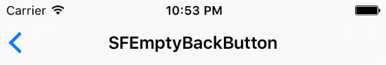

# SFEmptyBackButton

[](https://github.com/Carthage/Carthage)
[](http://cocoapods.org/pods/SFEmptyBackButton)
[](http://cocoapods.org/pods/SFEmptyBackButton)
[](http://cocoapods.org/pods/SFEmptyBackButton)

## Usage

To remove the title back button is only necessary to invoke:
```obj-c
// Magic happens here
[SFEmptyBackButton removeTitleFromAllViewControllers];
```

If you only want to delete the title in certain views invokes this:
```obj-c
[SFEmptyBackButton removeTitleFromViewControllers:@[YourViewController.class, AnotherViewController.class];
```

## How It Works

When you have a view with a very long title like this:

<p align="center">  
	
</p>

And navigate to another view with a very long title the following occurs:

<p align="center">  
	
</p>

If you delete the title back button invoking:
```obj-c
[[UIBarButtonItem appearance] setBackButtonTitlePositionAdjustment:UIOffsetMake(-100, 0) forBarMetrics:UIBarMetricsDefault];
```

Most likely this will happen:
<p align="center">  
	
</p>

But if you rewrite back button with empty title in all views:

```obj-c
UIBarButtonItem *backButtonItem = [[UIBarButtonItem alloc] initWithTitle:@"" style:UIBarButtonItemStylePlain target:nil action:nil];

[self.navigationItem setBackBarButtonItem:backButtonItem];
```

You get the desired effect:

<p align="center">  
	
</p>

## Installation

### CocoaPods

SFEmptyBackButton is available through [CocoaPods](http://cocoapods.org). To install
it, simply add the following line to your Podfile:

```ruby
pod "SFEmptyBackButton"
```

### Carthage

You can also install it via [Carthage](https://github.com/Carthage/Carthage). To do so, add the following to your Cartfile:

```ruby
github "fdzsergio/SFEmptyBackButton"
```

## Author

Sergio Fernández, fdz.sergio@gmail.com

## Acknowledgement

This [CocoaPod](https://cocoapods.org/pods/SFEmptyBackButton) has been made possible thanks to [Aspects](https://github.com/steipete/Aspects) by [@steipete](http://petersteinberger.com) 

## License

SFEmptyBackButton is available under the MIT license. See the LICENSE file for more info.
